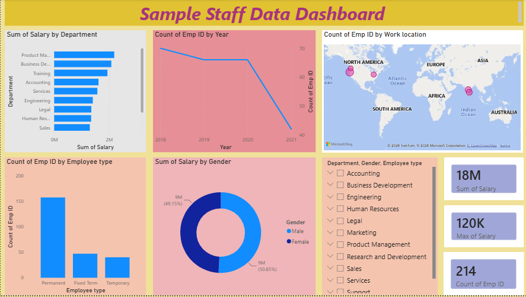

# Staff Data PowerBI Dashboard

## Dashboard Preview

## Overview
HR analytics dashboard for 214 employees across departments and locations. Built using PowerBI and cleaned with Power Query.

## Key Metrics
- **Total Salary**: 18M
- **Max Salary**: 120K  
- **Total Employees**: 214

## Data Transformation - Power Query
Raw data had issues like `???`, `########`, inconsistent dates.
Cleaned using:
- Removed duplicates and nulls
- Standardized date formats
- Fixed data types for Salary and Department

## Files Included
- `Staff-Dashboard.pbix` - Interactive dashboard
- `sample-staff-data.xlsx` - Unclean source data
- `staff-dashboard.png` - Dashboard screenshot

## How to Use
1. Download all files
2. Open `.pbix` in PowerBI Desktop Free
3. Click `Refresh` to connect with data
